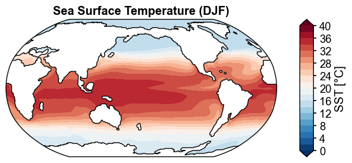
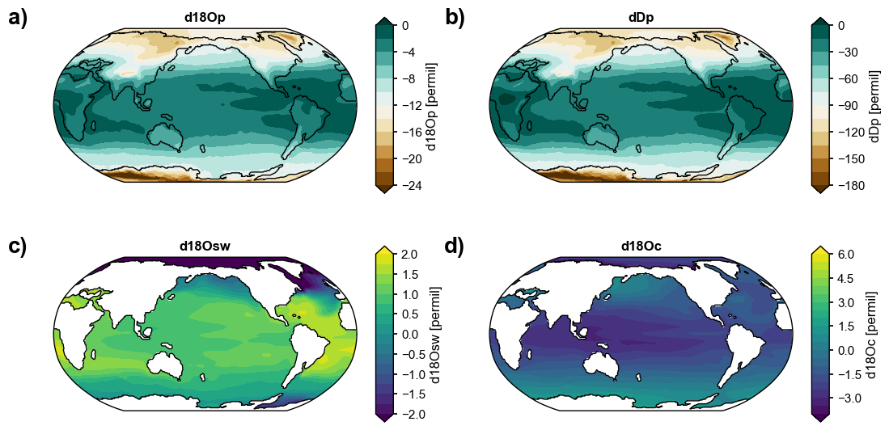
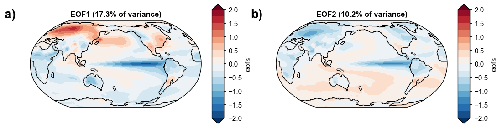
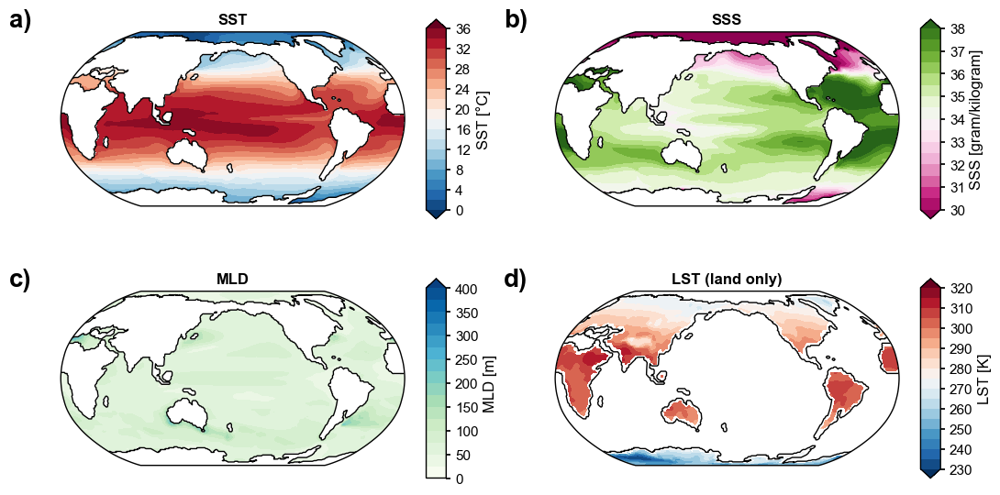
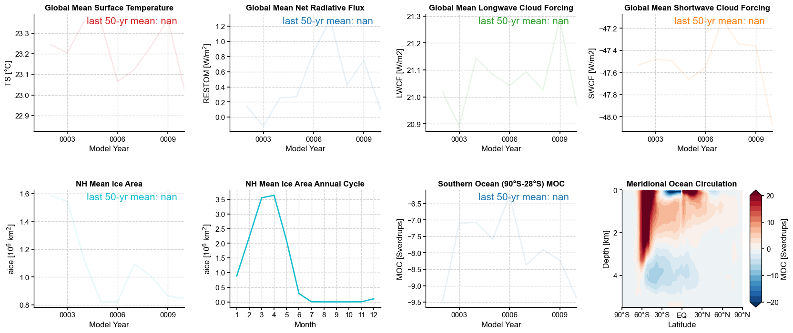
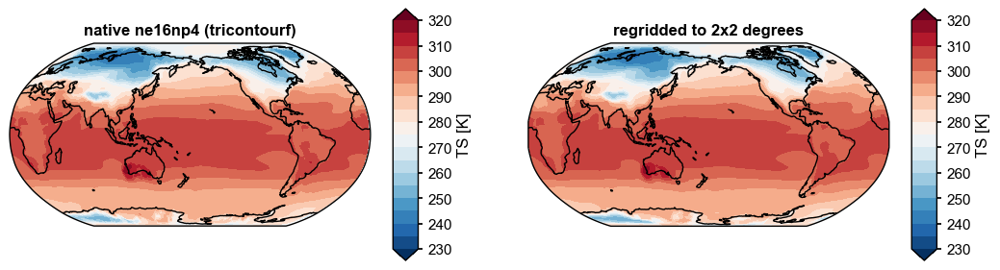
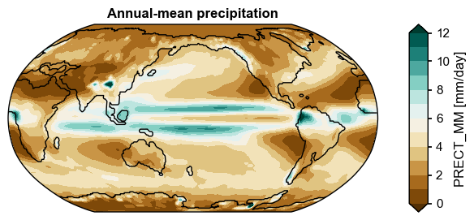
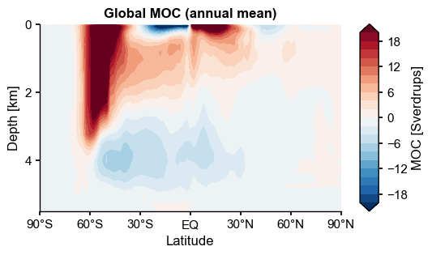
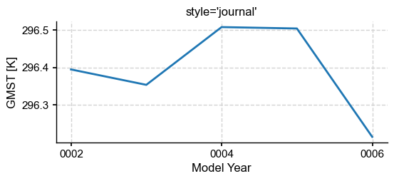

<div class="x4c-hero">
  <h1>x4c</h1>
  <p class="x4c-tagline">
    An Xarray extension for CESM output. <strong>One line of code, one
    publication-ready climate map</strong> — plus postprocessing, regridding, and
    diagnostics that already know what a CESM grid is.
  </p>

  <div class="x4c-install">
    <span class="x4c-prompt">$</span>
    <span>pip install x4c</span>
    <button onclick="
      navigator.clipboard.writeText('pip install x4c');
      this.textContent='copied';
      this.classList.add('copied');
      setTimeout(()=>{this.textContent='copy';this.classList.remove('copied')},1400);
    ">copy</button>
  </div>

  <div class="x4c-cta">
    <a class="x4c-btn-primary" href="ug-installation">Get started</a>
    <a class="x4c-btn-ghost" href="https://github.com/NCAR/x4c">View on GitHub</a>
  </div>

  <div class="x4c-hero-shot">
    
    <div class="x4c-hero-code"><code>case.plot("SST:-12,1,2")</code></div>
  </div>
</div>

<div class="x4c-section">
  <h2>Made with <code>.x.plot()</code></h2>
  <p class="x4c-lede">
    Every figure below comes from a notebook in this documentation, and every one
    is reachable in a line or two. Click any to open the notebook that produced it.
  </p>

  <div class="x4c-gallery">

    <a class="x4c-shot" href="diags-variables">
      
      <div class="x4c-shot-meta">
        <div class="x4c-shot-title">Water isotopes, annual mean</div>
        <div class="x4c-shot-code">da.x.regrid(2,2).x.annualize().mean('time').x.plot(…)</div>
      </div>
    </a>

    <a class="x4c-shot" href="core-analysis">
      
      <div class="x4c-shot-meta">
        <div class="x4c-shot-title">EOFs of sea-surface height</div>
        <div class="x4c-shot-code">m.x.plot(ax=axd[k], ssv=ssv, cmap='RdBu_r', …)</div>
      </div>
    </a>

    <a class="x4c-shot" href="diags-variables">
      
      <div class="x4c-shot-meta">
        <div class="x4c-shot-title">Ocean and land state</div>
        <div class="x4c-shot-code">ocean['SST'].x.regrid(2,2).mean('time').x.plot(…)</div>
      </div>
    </a>

    <a class="x4c-shot" href="diags-quickview">
      
      <div class="x4c-shot-meta">
        <div class="x4c-shot-title">A whole diagnostics dashboard</div>
        <div class="x4c-shot-code">case.quickview(timespan=(1, 10))</div>
      </div>
    </a>

    <a class="x4c-shot" href="core-regridding">
      
      <div class="x4c-shot-meta">
        <div class="x4c-shot-title">Native grid to regular lat/lon</div>
        <div class="x4c-shot-code">ds.x.da.isel(time=0).x.regrid().x.plot(…)</div>
      </div>
    </a>

    <a class="x4c-shot" href="diags-new-vars">
      
      <div class="x4c-shot-meta">
        <div class="x4c-shot-title">A variable you defined yourself</div>
        <div class="x4c-shot-code">case.calc('PRECT_MM|regrid(2,2):ann')</div>
      </div>
    </a>

    <a class="x4c-shot" href="core-visualization">
      
      <div class="x4c-shot-meta">
        <div class="x4c-shot-title">Vertical sections, same call</div>
        <div class="x4c-shot-code">moc.x.plot(levels=np.linspace(-20, 20, 21))</div>
      </div>
    </a>

    <a class="x4c-shot" href="core-visualization">
      
      <div class="x4c-shot-meta">
        <div class="x4c-shot-title">Publication styles, built in</div>
        <div class="x4c-shot-code">x4c.set_style('journal')</div>
      </div>
    </a>

  </div>
</div>

<div class="x4c-section">
  <h2>What it does</h2>

  <div class="x4c-cards">

    <a class="x4c-card" href="ug-core">
      <div class="x4c-card-icon">◈</div>
      <h3>Core features</h3>
      <p>The <code>.x</code> accessor knows where grid-cell areas live, how to find
      lat/lon on an unstructured grid, and how the vertical coordinate is spaced.</p>
    </a>

    <a class="x4c-card" href="ug-post">
      <div class="x4c-card-icon">⇄</div>
      <h3>Postprocessing</h3>
      <p>Turn history files into timeseries with <code>History.gen_ts()</code> —
      MPI-parallel splitting and merging over NCO.</p>
    </a>

    <a class="x4c-card" href="ug-diags">
      <div class="x4c-card-icon">◍</div>
      <h3>Diagnostics</h3>
      <p>Index a whole case with <code>Timeseries</code>, compute derived variables
      on demand, and compress a processing chain into a single spell string.</p>
    </a>

  </div>
</div>

## Getting started

`x4c` installs from PyPI. The regridding and pressure-level features additionally
need a few conda-only packages — see [Installation](ug-installation.md) for the
full environment.

```bash
pip install x4c
```

```python
import x4c

ds = x4c.load_dataset('b.e13.TS.nc')
ds.x.da.isel(time=0).x.plot(title='Surface temperature, month 1')
```
